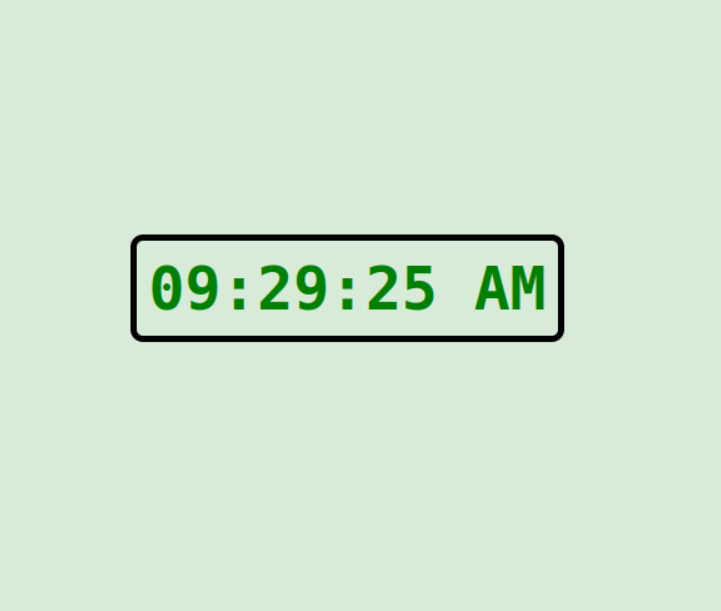

# Digital Clock - React

## Overview
This is a simple digital clock built with React that displays the current time in a 12-hour format with AM/PM. The clock automatically updates every second to reflect the current system time.

## Features
* Displays the current time in HH:MM:SS AM/PM format.
* Updates every second using setInterval.
* Responsive and lightweight.

## Installation
### Prerequisites
Ensure you have Node.js and npm installed on your machine.

## Steps
1. Clone this repository: 
```https://github.com/collins-kimotho/Digital-Clock.git```

2. navigate to the project directory:
```cd Digital-Clock```

3. Intall dependencies:
```npm install```

4. Start the development server:
```npm start```

The ap will be accessible at ```http://localhost:3000```.

## How it works
The clock uses JavaScript's Date object to get the current time and displays it in the format of HH:MM:SS AM/PM. A React useState hook manages the time, and useEffect is used to update the time every second.



## Contact
For questions or collaboration, contact me at: <br>
Email: [collinskimotho16@gmail.com](collinskimotho16@gmail.com) <br>
Github: [collins-kimotho](https://github.com/collins-kimotho)

